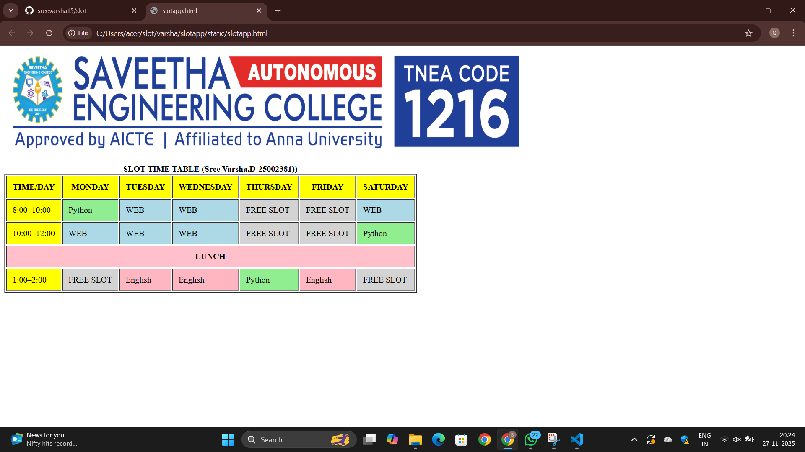

# Ex02 Time Table
## Date:27-11-15

## AIM
To write a html webpage page to display your slot timetable.

## ALGORITHM
### STEP 1
Create a Django-admin Interface.

### STEP 2
Create an App inside the Django project.

### STEP 2
Create a static folder uder the created App and insert HTML code.

### STEP 3
Create a simple table using ```<table>``` tag in html with the relevant attributes.

### STEP 4
Add rows using ```<tr>``` tag.

### STEP 5
Add your course schedule using ```<td>``` tag.

### STEP 6
Execute the program using runserver command.

## PROGRAM
```
<html>
    <body>
        
        <br><br>

        <table border="2" cellspacing="3" cellpadding="11">
            <caption><b>SLOT TIME TABLE (Sree Varsha.D-25002381))</b></caption>

            <tr bgcolor="yellow">
                <th>TIME/DAY</th>
                <th>MONDAY</th>
                <th>TUESDAY</th>
                <th>WEDNESDAY</th>
                <th>THURSDAY</th>
                <th>FRIDAY</th>
                <th>SATURDAY</th>
            </tr>

           
            <tr>
                <td bgcolor="yellow">8:00–10:00</td>
                <td bgcolor="lightgreen">Python</td>
                <td bgcolor="lightblue">WEB</td>
                <td bgcolor="lightblue">WEB</td>
                <td bgcolor="lightgray">FREE SLOT</td>
                <td bgcolor="lightgray">FREE SLOT</td>
                <td bgcolor="lightblue">WEB</td>
            </tr>

            
            <tr>
                <td bgcolor="yellow">10:00–12:00</td>
                <td bgcolor="lightblue">WEB</td>
                <td bgcolor="lightblue">WEB</td>
                <td bgcolor="lightblue">WEB</td>
                <td bgcolor="lightgray">FREE SLOT</td>
                <td bgcolor="lightgray">FREE SLOT</td>
                <td bgcolor="lightgreen">Python</td>
            </tr>

            <tr bgcolor="pink">
                <td colspan="7" align="center"><b>LUNCH</b></td>
            </tr>


            <tr>
                <td bgcolor="yellow">1:00–2:00</td>
                <td bgcolor="lightgray">FREE SLOT</td>
                <td bgcolor="lightpink">English</td>
                <td bgcolor="lightpink">English</td>
                <td bgcolor="lightgreen">Python</td>
                <td bgcolor="lightpink">English</td>
                <td bgcolor="lightgray">FREE SLOT</td>
            </tr>
```

## OUTPUT


## RESULT
The program for creating slot timetable using basic HTML tags is executed successfully.
